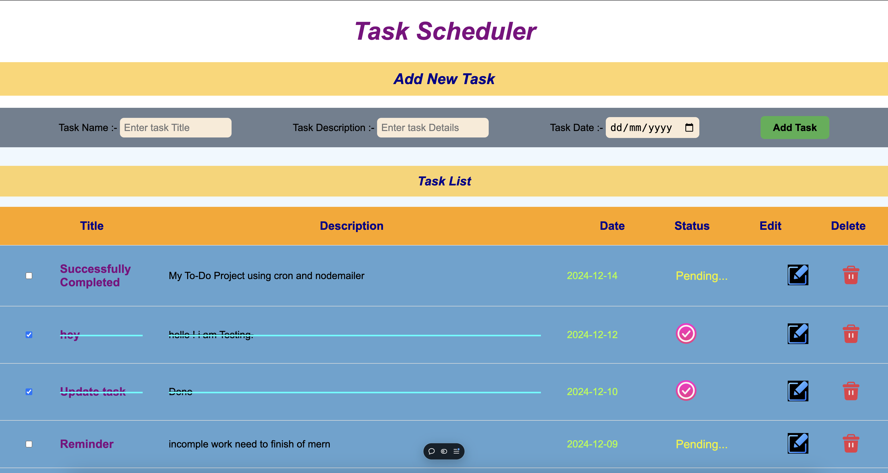

# Task Scheduler Application

---

## Overview

The Task Scheduler is a web application that allows users to manage their daily tasks efficiently. It features task creation, editing, marking tasks as complete/incomplete, and deletion. Users can interact with the application to schedule tasks with a title, description, and due date.

The application is built using React for the frontend, Axios for API communication, and a backend hosted with environment-specific routes.

---

## ScreenShort



---

### Features

1. Add Tasks

    Users can add tasks by providing a title, description, and date.

    Upon submission, tasks are stored in the backend, and the task list is updated in real time.

2. View Tasks

    Displays all tasks fetched from the backend in reverse chronological order (most recent first).

    Tasks include their title, description, date, and completion status.

3. Update Tasks

    Users can edit task details such as the title, description, and date.

    The update form appears inline for seamless editing.

4. Mark as Complete/Incomplete

    Users can mark tasks as complete or incomplete using a checkbox.

    Completed tasks are visually distinguished using a line-through style and a checkmark icon.

5. Delete Tasks

    Users can delete tasks with a single click.

    A confirmation is shown via toast notifications.

## Technologies Used

### Frontend

`React` : For building a dynamic user interface.

`Axios` : For API calls to interact with the backend.

`React Toastify` : For user-friendly notifications and feedback.

### Backend (Expected Requirements)

`Node.js` with `Express.js` for managing the API routes.

`MongoDB` for storing task data.

`Node-Cron` for `scheduling tasks` (optional, based on feature expansion).

### Styling

`CSS` : Custom styling for a clean and responsive user experience.

Custom classes for task cards, forms, and buttons.

---

## Installation and Setup

### Prerequisites

* Node.js and npm installed on your system.

### Backend Setup

1. Clone the backend repository or set up a Node.js backend.

2. Ensure the backend has the following routes:

* `GET` `/all-task-list` :- Fetch all tasks.

* `POST` `/create-task` :- Add a new task.

* `PUT` `/update-task/:taskId` :- Update a task.

* `DELETE` `/delete-task/:taskId` :- Delete a task.

3. Configure your backend to allow CORS for the React frontend.

4. Use a `.env` file to define your backend route:
    ```
    VITE_HOSTED_ROUTE=http://localhost:9000
    ```

### Frontend Setup

1. Clone this repository.

2. Install dependencies:
    ```
    npm install
    ```

3. Start the application:
    ```
    npm run dev
    ```

4. Ensure the .env file in the root directory includes the following:
    ```
    VITE_HOSTED_ROUTE=http://localhost:9000
    ```

---

## File Structure
```
src
├── components
│   ├── AddTaskForm.jsx       # Component for adding new tasks
│   ├── TaskList.jsx          # Component to display the task list
│   ├── UpdateTaskForm.jsx    # Component for editing tasks
├── assets
│   ├── check.png             # Icon for completed tasks
│   ├── edit.png              # Icon for editing tasks
│   ├── delete.png            # Icon for deleting tasks
├── App.jsx                   # Main application component
├── main.jsx                  # React entry point
├── styles.css                # Custom styles
```

---

## Environment Variables

The project requires the following environment variables to be defined in a `.env` file:

```
VITE_HOSTED_ROUTE: The base URL for the backend server.
```

Example:
```
VITE_HOSTED_ROUTE=http://localhost:5000
```

---

## Usage

1. `Add a Task`:

* Enter the task name, description, and due date in the provided form.

* Click the "Add Task" button to save the task.

2. `View Task List`:

* All tasks are displayed with their title, description, date, and status.

3. `Update a Task`:

* Click the edit icon next to a task to open the update form.

* Modify the fields and click "Update Task" to save changes.

4. Mark as Complete:

* Use the checkbox to mark a task as complete or incomplete.

5. Delete a Task:

* Click the delete icon next to a task to remove it.

---

## Future Enhancements

* Add user authentication for personalized task management.

* Implement search and filter functionality for tasks.

* Integrate reminders and notifications for upcoming tasks.

* Add a calendar view for visualizing tasks.

---

License

This project is licensed under the MIT License. Feel free to use and modify it as needed.